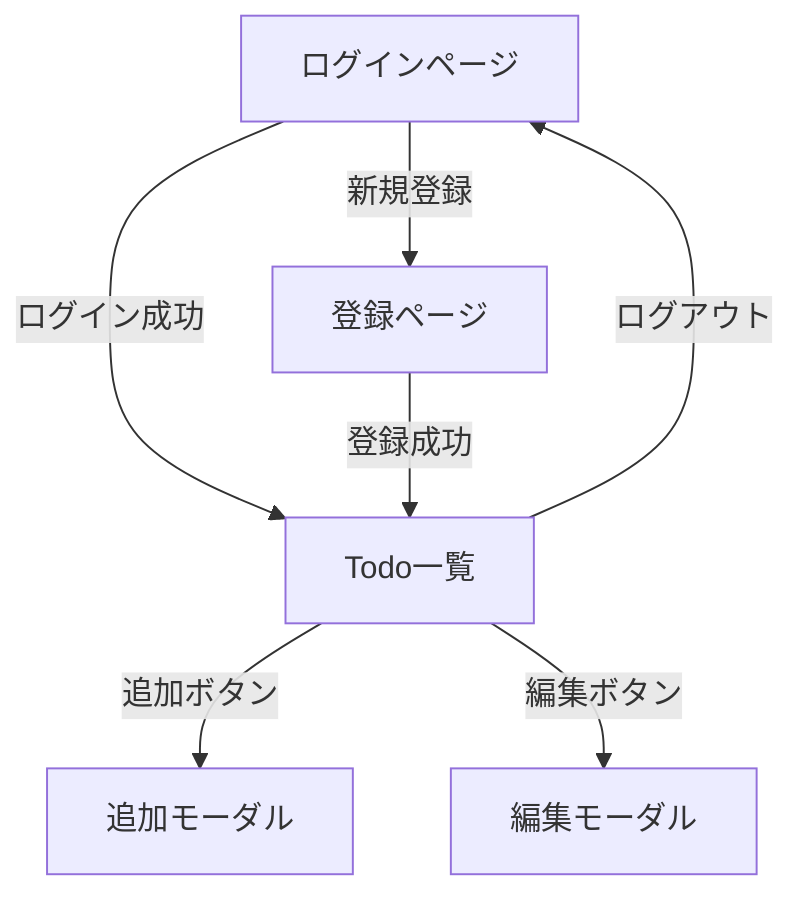
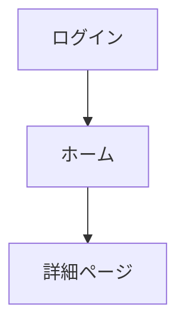

## この記事で学ぶこと

- 画面遷移図とは
- 遷移図の作り方
- 実例

---

## 画面遷移図とは

どの画面からどの画面に移動できるかを図にしたものです。

```
ログインページ
    ↓ ログイン成功
Todo一覧ページ
    ├→ Todo追加モーダル
    ├→ Todo編集モーダル
    └→ 設定ページ
```

---

## 遷移図の作り方

### 手順

1. すべての画面を洗い出す
2. 画面同士の関係を矢印で繋ぐ
3. 条件を書く（〜したら など）

### ツール

```
おすすめ：
├── Figma（図形ツール）
├── Mermaid（テキストで図を描く）
├── draw.io
└── 紙とペン
```

---

## 実例：Todo アプリ



---

## 認証の流れ

```
未ログイン → ログインページ
    ↓ ログイン成功
ログイン済み → メインページ
    ↓ ログアウト
未ログイン → ログインページ
```

---

## 💡 Try: 画面遷移図を書いてみよう

以下のいずれかの形式で、あなたのアプリの画面遷移図を作成してみましょう：

1. **紙に手書き**で画面を四角で描き、矢印で繋ぐ
2. **Mermaid** で以下のテンプレートを編集する



---

## まとめ

この記事では、画面遷移図の作り方を学びました。

- 画面遷移図は**どの画面からどの画面に移動できるか**を示す
- すべての画面を洗い出し、**矢印で繋ぐ**
- **Mermaid** や **Figma** で作成できる

---

## 次の記事へ

08-07. 画面ごとの要素を洗い出す
